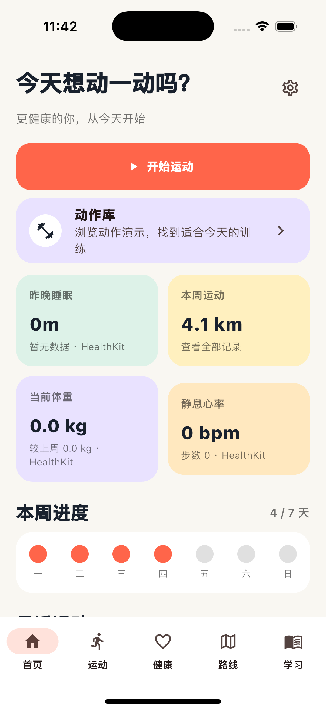
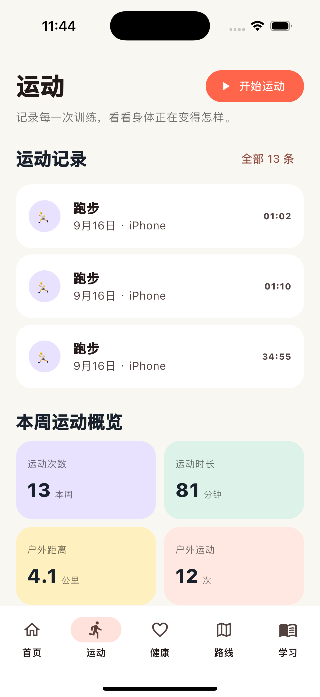
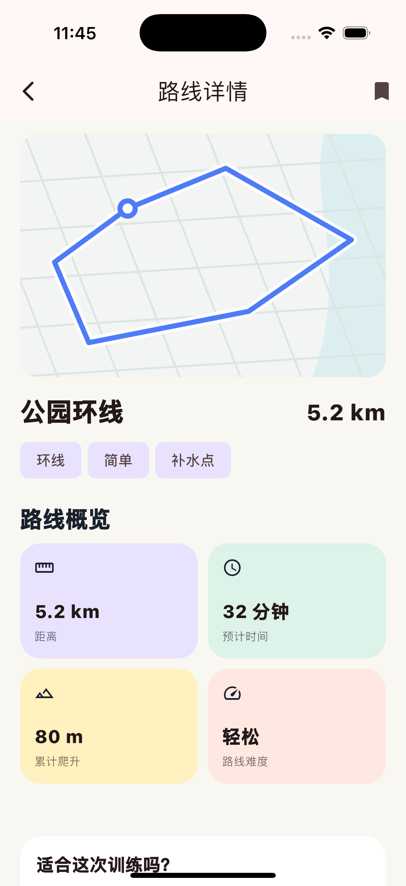
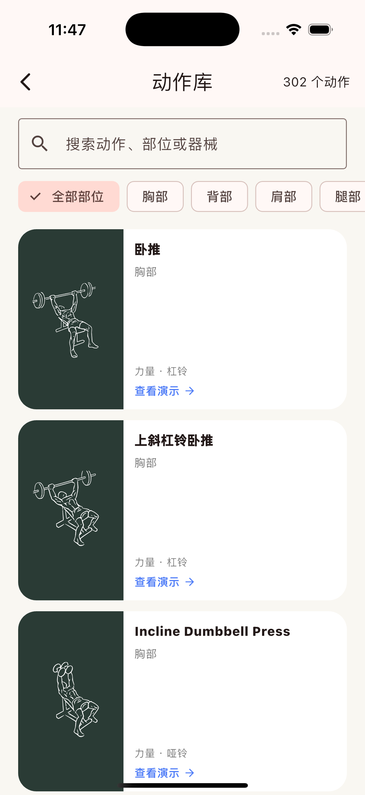
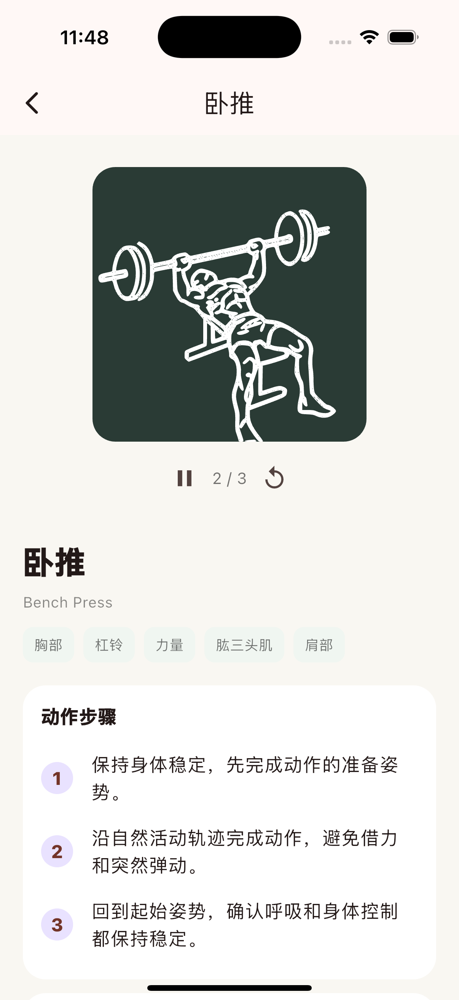

<p align="center">
  
</p>

<h1 align="center">Movea 动迹</h1>

<p align="center">本地优先、跨平台的户外运动、力量训练、恢复与健康伙伴。</p>

<p align="center">
  <a href="README.md">English</a> · <a href="README.zh-CN.md">简体中文</a>
</p>

<p align="center">
  <a href="https://github.com/wu9o/movea/actions/workflows/flutter-ci.yml"></a>
  <a href="https://github.com/wu9o/movea/actions/workflows/app-build.yml"></a>
  <a href="https://github.com/wu9o/movea/releases"></a>
  <a href="LICENSE"></a>
</p>

> [!WARNING]
> Movea 仍处于 Alpha 阶段，主要用于个人使用和产品探索，不能替代专业医疗或训练建议。

## 产品实拍

<p align="center">
  
  
  
  
  
</p>

截图来自当前 Flutter 应用在 iPhone 16 Pro 模拟器中的真实运行效果，记录内容为演示数据。

## 当前能力

| 领域 | 当前体验 |
| --- | --- |
| 户外运动 | 跑步和骑行记录、GPS 质量、暂停恢复、距离、配速和轨迹 |
| 路线 | MapLibre + OpenFreeMap、路线保存与跟随、偏航判断、语音和触觉提醒 |
| 运动分析 | 全部记录、训练日历、周报、负荷趋势、心率曲线和个性化区间 |
| 健身训练 | 302 个可检索动作、906 帧插画、训练计划、组数、计时和休息间隔 |
| 健康 | HealthKit 导入、睡眠阶段与质量、体重、恢复信息和数据来源 |
| 数据安全 | 本地优先、完整性快照、诊断与 AES-256-GCM 加密备份恢复 |
| Apple Watch | 已有原生训练会话源码，仍需正式 Target 接入与配对真机验证 |
| Android | 共享 Flutter 体验已规划，定位与 Health Connect 适配仍在推进 |

## 产品原则

- 本地数据是唯一主数据源，云端只承担可选的加密备份。
- 运动记录必须支持离线完成。
- 真实健康数据与演示数据必须清晰区分。
- 先建立共享领域模型，再完成各平台的界面与适配。
- iPhone、iPad、Mac、Android 和 Apple Watch 分别进行交互与布局走查。
- 地图应突出运动轨迹与方向，而不是用地点信息淹没路线。

## 平台规划

| 平台 | 角色 | 实现 |
| --- | --- | --- |
| iPhone | 完整运动、路线、训练和健康体验 | Flutter |
| iPad | 分栏记录、路线规划和健康分析 | Flutter 自适应布局 |
| macOS | 历史、趋势、计划和数据管理 | Flutter macOS |
| Android | 运动、路线、训练和健康 | Flutter |
| Apple Watch | 快速控制、心率和定位 | 原生 watchOS / SwiftUI |

## 快速开始

需要 Flutter 3.47 或兼容的 stable 版本、Dart 3.3+；构建 Apple 平台还需要 Xcode。

```bash
git clone https://github.com/wu9o/movea.git
cd movea/apps/movea
flutter pub get
flutter analyze
flutter test
flutter run
```

GPS 模拟和各平台验证方式见 [开发指南](docs/development.md) 与 [GPS 测试指南](docs/testing-gps.md)。

## 自动化构建

- **Flutter CI**：格式、静态分析和测试。
- **App Builds**：生成 Android Debug APK、iOS Simulator App 和 macOS Debug App。
- 流水线产物仅用于开发预览，不是已签名的应用商店安装包。

## 仓库结构

```text
movea/
├── apps/movea/                 # Flutter 主应用
├── packages/                   # 领域、数据和设计系统
├── watchos/MoveaWatch/         # 原生 Apple Watch 模块
├── docs/                       # 产品、架构、路线图和测试文档
├── tooling/                    # GPS 回放和开发工具
├── third_party/                # 第三方内容与署名
└── legacy/swiftui-prototype/   # 历史 SwiftUI 原型
```

## 下一阶段

1. 完成 Apple Watch 配对真机运动验证；
2. 强化真实设备上的 GPS 记录和路线引导；
3. 接入 Android Health Connect 与平台定位；
4. 完成 GitHub 加密备份的冲突处理和恢复体验；
5. 持续推进无障碍、多语言、性能和各端视觉走查。

完整规划见 [docs/roadmap.md](docs/roadmap.md)。

## 隐私与安全

运动和健康数据默认保存在设备本地。严禁提交 Token、明文健康导出、签名文件和个人路线数据；备份必须先在设备端完成加密。

安全问题请通过 [GitHub Security Advisories](https://github.com/wu9o/movea/security/advisories/new) 私下报告，不要创建公开 Issue。更多说明见 [SECURITY.md](SECURITY.md)。

## 贡献与许可证

欢迎提交问题、产品讨论和聚焦的 Pull Request。请先阅读 [CONTRIBUTING.md](CONTRIBUTING.md)，并在上传截图或日志前清除个人定位与健康信息。

Movea 自有源码使用 [MIT License](LICENSE)。来自 [Workout Guide](https://github.com/bryllim/workout-guide) 的动作插画按 [CC BY-SA 4.0](third_party/workout-guide/LICENSE-ASSETS) 使用。地图和运行时署名见 [THIRD_PARTY_NOTICES.md](THIRD_PARTY_NOTICES.md)。

<p align="center"><strong>Movea 0.1.0 · Trailhead / 起跑线</strong></p>
