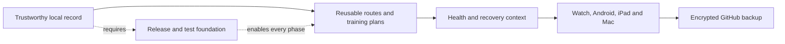

# Movea Product & Engineering Roadmap

> Status date: 2026-09-17 · baseline: `main` at `870c5a5`

Movea is a personal, local-first activity and health companion. The product is
not trying to become a social network or a subscription service. Its main job
is to make a personal record trustworthy, explainable and reusable across
devices.

## The decision that governs the roadmap

We will build Movea in this order:

The next feature is accepted only when it strengthens one of these links and
has a testable exit condition. This prevents the activity page, route page,
health page and training page from growing as unrelated demos.

## Where the repository is now

The following is verified from the current code and repository, not a future
proposal:

| Area | Current baseline | Confidence boundary |
| --- | --- | --- |
| Product shell | Flutter app with Today, Sports, Health, Routes and Learn navigation; responsive wide layout exists | iPhone is the primary validated surface; iPad and Mac still need dedicated visual QA |
| Outdoor activity | Run, ride, stretch and strength activity types; activity picker; pause/resume/finish flow; active workout draft recovery | Long-running real-device, lock-screen and low-power behavior still needs validation |
| GPS and route guidance | Core Location-compatible Flutter adapter, accepted GPS points, distance/pace derivation, planned-vs-actual track, off-route and turn cues | Android and Watch platform behavior is not proven end to end |
| Maps | MapLibre with a controlled OpenFreeMap/OpenMapTiles style and route overlays | Public tile availability, coverage, caching and long-term service terms are still operational risks |
| Sports hub | Workout records, training calendar, weekly report, training status and device-workout import entry points | Analytics are mostly local summaries; there is no durable trend/insight contract yet |
| Routes | Recommended, nearby and saved-route views; route detail; select, cancel and follow states | Route import/export, offline route packages and robust route editing are not complete |
| Training | 302 exercise definitions and 906 bundled illustration frames; plan editor, work/rest settings and plan runner | Content provenance, progression rules, comprehensive exercise QA and history are incomplete |
| Health | Shared `HealthSnapshot`; iOS HealthKit bridge for sleep, weight, steps, resting heart rate and device workouts; source labels and sleep detail UI | Android Health Connect is not implemented; health snapshots and raw sleep segments are not yet a durable local dataset |
| Local data | SharedPreferences stores workout, route, plan and recovery data; AES-256-GCM file backup/import and integrity snapshot exist | SharedPreferences is not sufficient for large GPS/health histories; GitHub remote backup is not implemented |
| Apple Watch | Native HealthKit workout coordinator and Watch Connectivity inbox source exists | No formal watchOS target, signed companion build or paired-device acceptance yet |
| Authentication | No GitHub sign-in or account/session flow is implemented | Required before a GitHub private-backup workflow can be safely shipped |
| Delivery | Flutter CI and App Builds are green; `v0.1.1` Preview Release has Android, iOS Simulator and macOS attachments | Android is development-signed, iOS is Simulator-only, and macOS is unsigned/not notarized |

## The gaps that matter most

The current risk is not a shortage of screens. It is that several screens can
look complete while the underlying data contract and platform behavior remain
partial.

### 1. The local data foundation is too small for the product goal

Workout summaries, routes and plans currently have persistence boundaries, but
GPS samples, heart-rate samples, sleep segments and sync metadata need a more
durable model. Long traces should not depend on one large preferences value.
The application also needs stable identifiers, source provenance, schema
versions, soft deletion and an explicit distinction between a local GPS record,
a HealthKit import and a manual entry.

### 2. GitHub backup has a contract but no complete product path

Movea currently supports local encrypted file export/import. The
`BackupRepository` interface is not a GitHub implementation. Missing pieces
include GitHub authentication, private-repository bootstrap or selection,
least-privilege token storage, encrypted shard upload, manifest versioning,
conflict handling and restore preview. GitHub must remain an encrypted backup
target, never the live database.

### 3. The multi-platform promise is ahead of its acceptance evidence

Flutter provides a shared application surface, but the platform-specific work
is not interchangeable. Android needs Health Connect and location validation;
Apple Watch needs a formal target and paired-device testing; iPad needs a
split-view information hierarchy; Mac needs keyboard, window-size and desktop
navigation checks.

### 4. The map is visually controlled but operationally dependent

MapLibre lets Movea control label density, colors and route emphasis. That
solves the visual problem, but not tile hosting, offline availability, cache
policy, attribution, coverage or rate limits. A self-hosted PMTiles/OpenMapTiles
option needs to be designed before the map becomes a critical offline feature.

### 5. The training library needs product rules, not only more illustrations

The exercise catalog is now a real asset, but the training system still needs
content metadata, muscle/equipment/skill filters, safety notes, progression,
plan history and a consistent execution contract. Every imported asset also
needs its license and attribution to remain traceable.

### 6. Release and visual QA need to become repeatable

The repository now produces a downloadable preview, but it is not a store
release. We need deterministic GPS playback, integration tests for workout
state transitions, screenshot checks for iPhone/iPad/Mac and a release checklist
that explicitly records signing, privacy, permissions and platform coverage.

### Current increment — P0 is now in progress

The first P0 slice is implemented locally: `MoveaApp` accepts an injected
location source, `ReplayLocationRepository` replays timestamped samples through
the same stream used by the geolocator adapter, and a widget test verifies
non-zero distance, calculated pace, GPS accuracy feedback and saved summary
data. The same test also caught and fixed a narrow-iPhone metric-card overflow.
The remaining P0 work is schema versioning, durable high-volume storage,
broader state-machine coverage and app-surface decomposition.

## Prioritized delivery plan

Dates are intentionally omitted. A phase exits by evidence, not by a calendar
promise. Work inside a phase can be split into small pull requests.

### P0 — Stabilize the foundation

**Objective:** make the current product maintainable and every future feature
observable.

- Split the 7,888-line application surface into feature areas: shell, sports,
  activity session, routes, training, health, settings and shared map UI.
- Define a versioned local data schema for workout records, GPS samples, routes,
  plans, sleep segments, health measurements and sync metadata.
- Migrate high-volume records away from a single preferences payload to a
  durable cross-platform local store; keep an export codec for recovery.
- Add a fake `LocationRepository` and deterministic GPX replay harness using
  `tooling/fixtures/park-loop.gpx`.
- Add state-machine tests for ready → recording → paused → resumed → finished,
  route selected → cancelled → replaced, and recovered draft → paused.
- Align `pubspec.yaml` version metadata with the release tag and make the
  release workflow verify the version before publishing.

**Exit criteria:** a replayed route produces the same distance, pace, GPS
quality and guidance events on every run; a process restart can recover a
paused draft; a schema migration can be tested without deleting local data.

### P1 — Make outdoor activity trustworthy

**Objective:** complete the core promise: record a real activity and reuse a
route without confusing planned and actual data.

- Add a clear preparation state: location permission, service status, GPS
  accuracy, selected activity and optional selected route.
- Keep ordinary “Start” free of any route until the user explicitly chooses
  one; render planned route, actual track and current position as separate
  layers and legends.
- Complete route selection, cancellation, replacement, recentering and
  “follow this route” behavior from both the route library and sports hub.
- Persist raw samples with accuracy, speed, altitude and timestamps; derive
  distance, current/average pace, elevation gain and data quality from them.
- Add finish review: map, split pace, quality summary, perceived effort, save
  as route, rename and delete/keep decisions.
- Validate foreground, background, lock-screen, permission denial, GPS loss,
  low-power mode and simulator playback on iPhone; then repeat the contract on
  Android.

**Exit criteria:** no fake track appears before recording; a route-following
activity visibly distinguishes plan from actual movement; an interrupted
activity can resume without inventing elapsed time or distance.

### P2 — Turn the exercise library into a training system

**Objective:** make a plan reusable, understandable and executable.

- Add catalog filters for movement pattern, muscle group, equipment, skill and
  training goal, plus search and favorites.
- Complete exercise detail: animation/frames, setup, steps, breathing, common
  mistakes, safety notes and related exercises.
- Make plan templates first-class: action order, work duration, repetitions,
  sets, action rest, round rest, rounds, difficulty and scheduled days.
- Add plan version/history so editing a template does not rewrite completed
  sessions.
- Make the runner a real state machine with action countdown, rest countdown,
  pause/resume, skip, previous/next, audio/haptic cues and completed-set
  persistence.
- Preserve Workout Guide license and attribution metadata with every bundled
  asset and document any future content source.

**Exit criteria:** a user can create a plan, run it from start to finish,
open an individual action demonstration during execution, resume after leaving
the screen and see the completed session in the sports history.

### P3 — Build health and recovery as a traceable dataset

**Objective:** turn health from a dashboard of values into a source-aware
context for activity decisions.

- Persist health snapshots and raw/normalized measurements with source,
  timestamp, unit and permission state.
- Complete iOS HealthKit flows for sleep stages, sleep intervals, wake periods,
  weight, steps, resting heart rate and device workouts with incremental sync
  and de-duplication.
- Implement Android Health Connect adapters behind the same domain contracts.
- Add manual entry for weight and perceived recovery when no platform source
  is available; never silently replace missing data with demo values.
- Expand sleep detail to show bedtime, wake time, total sleep, awake periods,
  deep/core/REM stages, data gaps and source freshness.
- Add recovery trends and simple personal comparisons; avoid medical diagnoses
  or unsupported readiness scores.

**Exit criteria:** every health value has a source and timestamp; permission
denial is visible; iOS and Android adapters produce the same shared model; a
sleep detail view can be reconstructed from persisted data offline.

### P4 — Deliver the platform promise

**Objective:** make each supported device useful for its own job.

- Create the formal watchOS target, capabilities, HealthKit usage text and
  Watch Connectivity integration.
- Validate Watch-only start/pause/resume/finish, live duration/distance/heart
  rate, offline operation and delayed transfer to iPhone without duplicates.
- Add iPad split-view layouts for sports records + detail, routes + route
  detail, and health trends + sleep detail.
- Add Mac window-size breakpoints, keyboard focus/order, desktop navigation,
  filtering, export and backup/restore workflows.
- Add platform permission and visual QA matrices for iPhone, iPad, Mac,
  Android and Watch.

**Exit criteria:** each platform has a documented supported workflow; Watch can
complete an activity without an active iPhone connection; returning data is
merged once; iPad and Mac do not reuse a phone-sized layout.

### P5 — Ship encrypted GitHub backup and recovery

**Objective:** give the personal user a safe, optional, multi-device backup
without turning GitHub into an online database.

- Implement native-app GitHub sign-in and store session credentials only in
  Keychain/Keystore; request the smallest repository permissions possible.
- Add a settings flow to connect an existing private repository or create a
  dedicated private backup repository after explicit confirmation.
- Encrypt before upload with the existing envelope design; keep passwords and
  plaintext health/activity payloads out of logs and repository metadata.
- Upload versioned encrypted shards plus a manifest with device ID, schema
  version, record IDs and checksums; make retries idempotent.
- Download and verify before displaying a restore preview; support merge,
  conflict review, rollback and missing-device recovery.
- Show backup state, last successful sync, pending changes, conflicts and
  recoverability in Settings.

**Exit criteria:** a second device can authenticate, download ciphertext,
preview the decrypted manifest and restore selected data; duplicate uploads
do not duplicate records; a repository viewer cannot read health or route
content.

### P6 — Harden maps, distribution and operations

**Objective:** make the app dependable outside the development machine.

- Evaluate OpenFreeMap service limits and coverage against the intended regions.
- Add a PMTiles/OpenMapTiles self-hosted option, offline region download,
  cache expiry and attribution checks.
- Add GPX import/export with privacy confirmation and route simplification
  that does not alter the recorded workout source.
- Add release channels: internal preview, public prerelease and signed store
  release; keep signing credentials outside the repository.
- Add crash-safe migration tests, large-history performance checks, accessibility
  checks, localization checks and release artifact integrity checks.

**Exit criteria:** a documented map provider decision exists; a route can be
viewed and followed in the supported offline scenario; each public release
identifies its signing and platform limitations.

## The next three engineering increments

The immediate line of work should be:

1. **Foundation hardening:** split the app surface, version the local schema,
   add deterministic GPS replay and state-machine tests.
2. **Outdoor activity completion:** finish the real-recording contract,
   route-selection states, finish review and iPhone background/lock-screen QA.
3. **Training system completion:** make the exercise catalog searchable and
   make plan execution persistable, including action-level demonstrations.

Health Connect, Watch connectivity and GitHub backup follow this order because
they depend on stable local records and mergeable identifiers. They should not
be used to hide gaps in the primary recording flow.

## Explicitly out of scope

- Membership, subscriptions, paid content or a social feed
- Public route sharing, leaderboards or follower mechanics
- Treating GitHub as a live database or storing plaintext health data there
- Fabricating GPS, heart-rate, sleep or calorie values when a source is absent
- Medical diagnosis, treatment recommendations or clinical readiness claims
- Shipping an unsigned development artifact as an App Store or Play Store release

## Release gates

Every phase must answer these questions before it is considered complete:

1. Can the feature work offline where its product promise requires it?
2. Can the user tell real, demo, manual and imported data apart?
3. Can the data be recovered after interruption or migration?
4. Has the behavior been tested on the platform named by the phase?
5. Are permissions, privacy implications, attribution and signing status documented?

The current public `v0.1.1` is a development preview. The next meaningful
product milestone is not a larger version number; it is a verified P0/P1
recording foundation with evidence from deterministic replay and real-device
validation.
